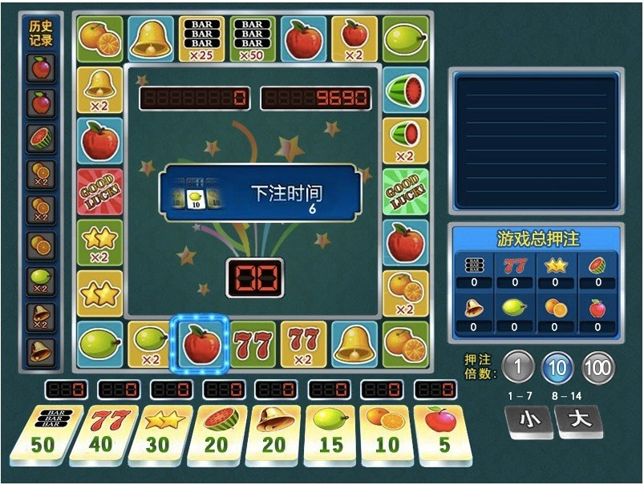

swoole_flash_game
=================

基于swoole扩展和zphp框架开发的flash游戏



安装swoole扩展：
```shell
pecl install swoole
```

ZPHP代码使用半桶水提供的代码库(注:为适应此游戏代码结构有小部分修改,具体自己可以进行对比比较)
ZPHP框架: <https://github.com/shenzhe/zphp>


运行
-----
1. 设置域名指向webroot目录
2. 修改webroot目录下面的index.php(SERVERIP,SERVERPORT,SOURCEURL)
3. 配置gambleapp/config/default/config.php(基本不用修改)
4. 导入gamble.sql
5. 配置gambleapp/config/public/下面3个文件
6. 设置log目录777权限
7. 启动gambleapp/bin/server.php
8. 打开网站首页

目前环境(php5.4.2+mysql5+redis2.6.14+swoole1.6.10)兼容最新swoole版本!
